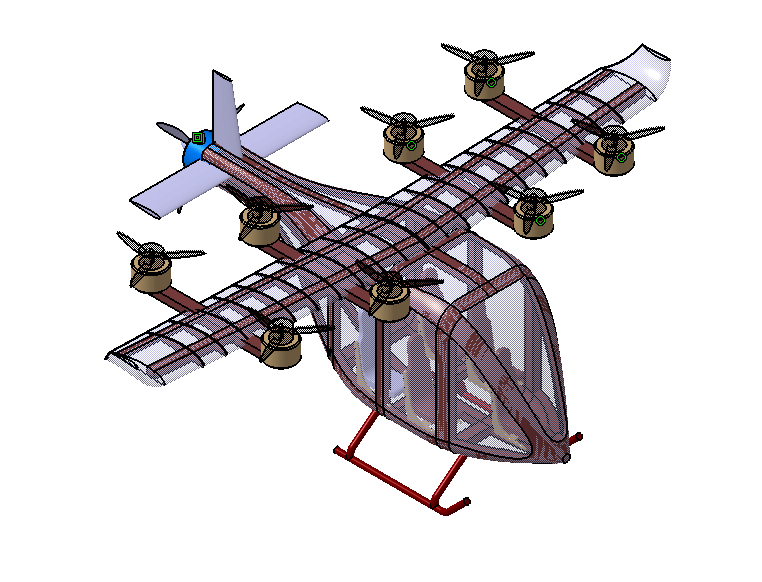
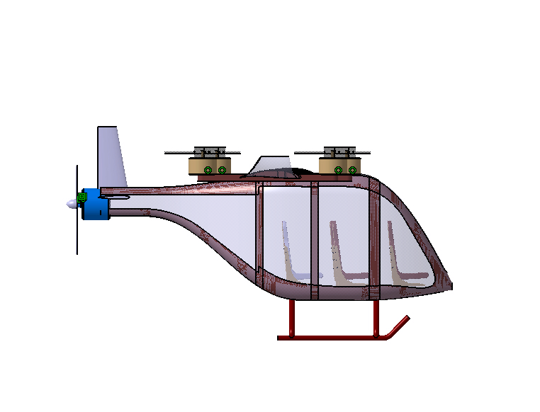
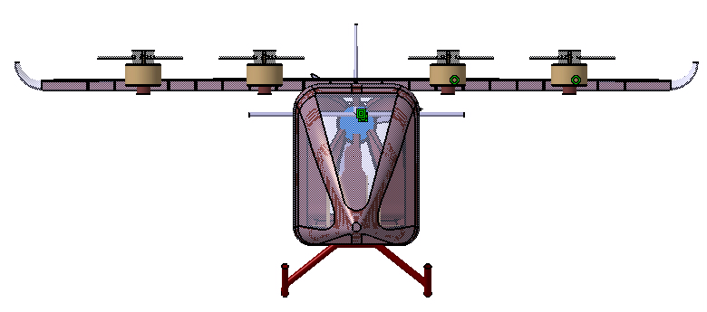
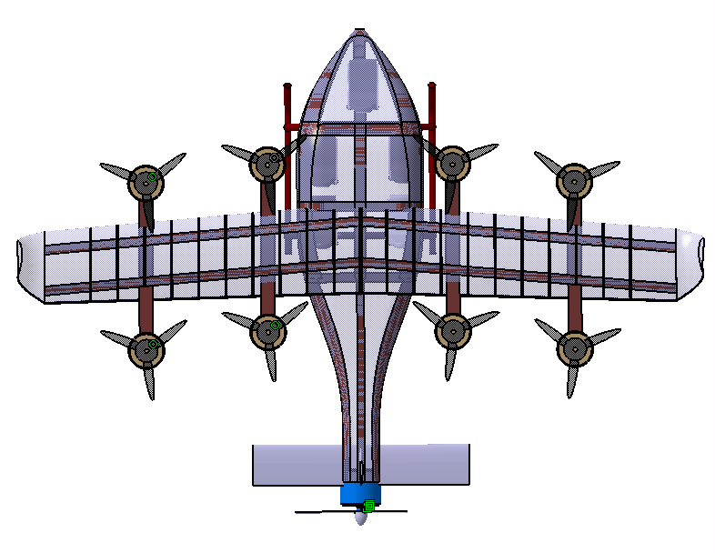

# 4-Pax VTOL Designed in CATIA

## Wing Design

| Parameter | Value |
|------------|--------|
| Root Chord | 1000 mm |
| Tip Chord | 700 mm |
| Wingspan | 11000 mm |

## Stabilizer Design

**Location**

- Y-location: 2800 mm from wing leading edge (LE)

### Horizontal Stabilizer

| Parameter | Value |
|------------|--------|
| Span | 2400 mm |
| Chord | 500 mm |

### Vertical Stabilizer

| Parameter | Value |
|------------|--------|
| Span | 1000 mm |
| Root Chord | 500 mm |
| Tip Chord | 300 mm |

## Fuselage Sizing

| Parameter | Value |
|------------|--------|
| Cross Section | 1800 mm (height) × 1400 mm (width) 2.5m long with this crosssection tapered on front and rear. |
| Overall Length | 6100 mm |

## Propulsion and Power System

### Energy Storage
- Main Battery Pack Volume: **0.96 m³**
- Battery integrated within the fuselage floor section to maintain a low center of gravity and improve stability.

### Cruise Propulsion
- Configuration: **Single Cruise Propeller**
- Diameter: **2500 mm**
- Function: Provides efficient forward thrust during cruise flight, reducing power consumption compared to lift rotors.

### Vertical Lift System
- Configuration: **8 Lift Propellers**
- Diameter: **1500 mm each**
- Total Lift Rotor Disk Area:

  \[
  A_{total} = 8 \times \pi \left(\frac{1.5}{2}\right)^2
  = 14.14\;m^2
  \]

- Function: Generates vertical thrust for takeoff, landing, and hover operations.

### Propulsion Architecture
- Type: **Lift + Cruise eVTOL**
- Lift Rotors: Dedicated vertical takeoff and landing
- Cruise Propeller: Dedicated forward flight propulsion
- Advantages:
  - Simpler control system than tilt-rotor configurations
  - Higher cruise efficiency
  - Reduced mechanical complexity
  - Improved safety through propulsion redundancy

| Parameter | Value |
|------------|--------|
| Battery Volume | 0.96 m³ |
| Cruise Propeller Diameter | 2500 mm |
| Number of Lift Propellers | 8 |
| Lift Propeller Diameter | 1500 mm |
| Total Lift Disk Area | 14.14 m² |
| Configuration | Lift + Cruise eVTOL |
---

## CATIA Rendering

### Isometric View

### Three-Views Configuration

> **Note:** Conceptual 4-passenger eVTOL configuration developed and modeled in CATIA for preliminary design studies.