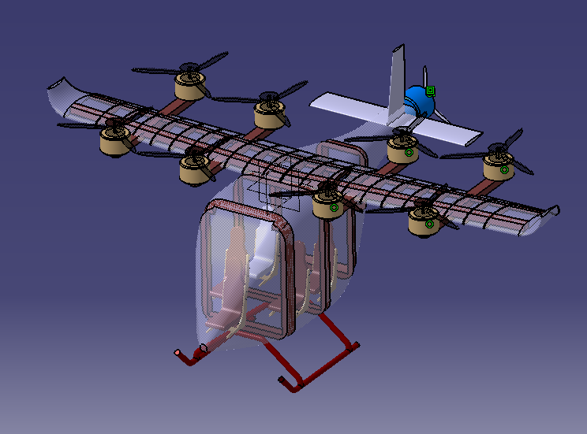
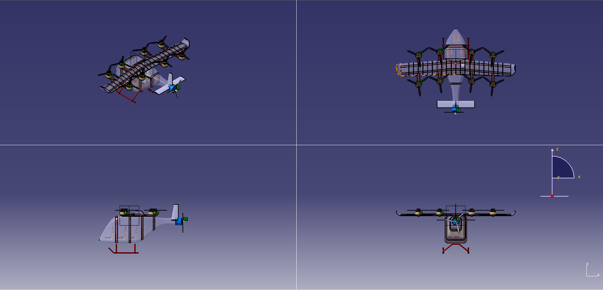

## 4-Pax VTOL Designed in CATIA

### CATIA Rendering

#### Isometric View

#### Four-View Configuration

> [!NOTE]
>  I am working on some interior details and fuselage loadpaths.(this includes the landing gear you mentioned earlier) check back towards midnight here in Nepal , I'll have commited final version. lmk if theres some change needed in structural representation in the mean time.
